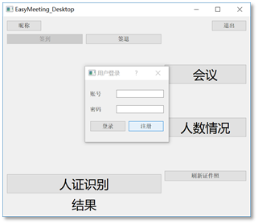
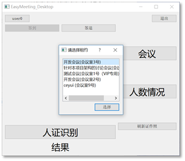
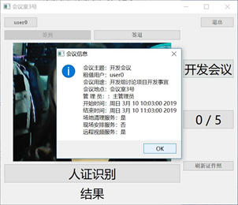
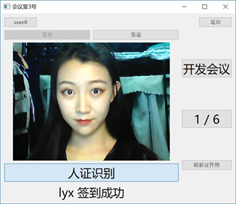
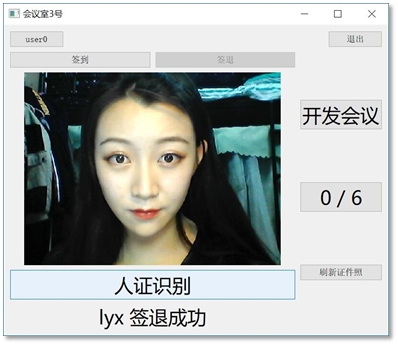
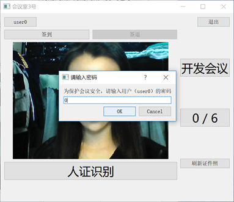

# 二、会议室前端设计

​	会议室前端采用Qt开发，实现了用户登录、选择会议、显示会议信息、人脸识别签到、签退、查看签到人员等功能、

## 1、登录与选择会议

​	会议室前端需要开会用户进行登录方可进去，点击exe文件启动后，显示登录对话框。

​	输入开会人员的账号与密码，点击确定，进入选择会议的界面。这些会议会从服务器中获取，并且按从新到旧的顺序排列。点击选择按钮，进入会议室前端人脸识别签到的首页。

## 2、会议信息

​	进入主页后，左边是一个摄像框，捕获摄像头前的人脸。右边有三个按钮，分别是会议名称、签到数量、刷新证件照。点击会议名称，显示本场会议的所有信息，包括会议名称、会议室地点、会议时间、申请的额外服务等，如图所示。点击签到数量，会显示本场会议的签到人数、签退人数，包含名字。

## 3、人脸识别

​	选择会议之后，会在项目运行目录下生成一个名为“cards/”的文件夹，把会议所有人脸识别的证件照复制到文件夹下，点击“刷新证件照”，即可更新与会人员列表。而不需要与会人员自行注册EasyMeeting的账号。

​	采用证件照的方式，同样也支持了外宾进入，只需要一张证件照即可。在识别的同时，摄像框下方的结果会显示签到者的名字，也方便礼仪人员的问候，大大提高了会议的人性化程度。

​	人脸识别流程：脸伸到摄像头前，点击人证识别按钮，或者稍等三秒进行自动识别。如果人脸信息与在“cards”文件夹下的某一张证件照有所相似，则会显示签到结果，摄像框下方显示签到者的姓名，并且界面右边的已签到人数加一。

​       签到过程如图3.5.4所示，人证识别后，右边显示签到人数的按钮从“0/6”变成了“1/6”。点击人数按钮，显示所有签到并且没有签退的用户姓名。

## 4、签退

​	签退的流程与签到一模一样，只需要点击摄像框上方的“签退”按钮，从签到模式切换到签退模式，再进行人脸识别操作。签退后，人数按钮依次减一，直到所有人员签退完毕变成0。如图3.5.6所示，显示人数的按钮从“1/6”变成了“0/6”。

## 5、安全设置

​	由于本程序的重要性与安全性，在重要的地方都设置了密码，需要输入会议室申请人的密码才能继续进行操作，例如切换会议、关闭程序等；而人脸识别则不需要密码，多人轮流识别。此设计避免了由于他人的恶意操作而造成的损失，又保证了便捷性。

